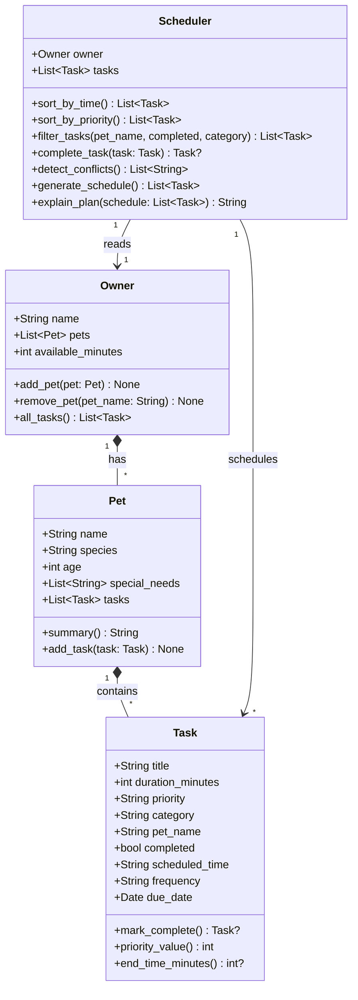

# PawPal+ Final Class Diagram (Mermaid.js)

Paste the code block below into the [Mermaid Live Editor](https://mermaid.live) or preview it in VS Code with a Mermaid extension.

```mermaid
classDiagram
    class Task {
        +String title
        +int duration_minutes
        +String priority
        +String category
        +String pet_name
        +bool completed
        +String scheduled_time
        +String frequency
        +Date due_date
        +mark_complete() Task?
        +priority_value() int
        +end_time_minutes() int?
    }

    class Pet {
        +String name
        +String species
        +int age
        +List~String~ special_needs
        +List~Task~ tasks
        +summary() String
        +add_task(task: Task) None
    }

    class Owner {
        +String name
        +List~Pet~ pets
        +int available_minutes
        +add_pet(pet: Pet) None
        +remove_pet(pet_name: String) None
        +all_tasks() List~Task~
    }

    class Scheduler {
        +Owner owner
        +List~Task~ tasks
        +sort_by_time() List~Task~
        +sort_by_priority() List~Task~
        +filter_tasks(pet_name, completed, category) List~Task~
        +complete_task(task: Task) Task?
        +detect_conflicts() List~String~
        +generate_schedule() List~Task~
        +explain_plan(schedule: List~Task~) String
    }

    Owner "1" *-- "*" Pet : has
    Pet "1" *-- "*" Task : contains
    Scheduler "1" --> "1" Owner : reads
    Scheduler "1" --> "*" Task : schedules
```
